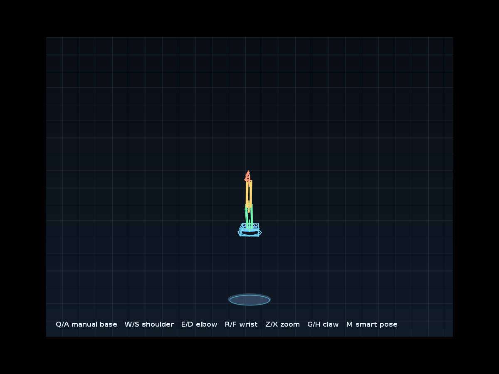
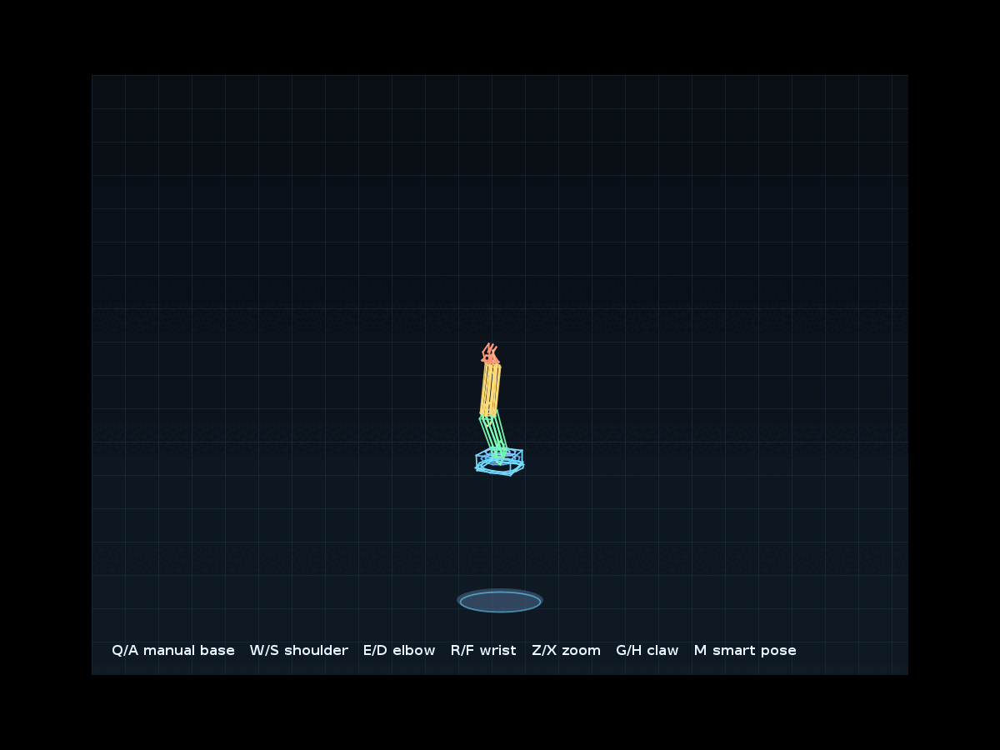

# 🦾 3D Wireframe Robotic Arm

<strong>Java • Swing/AWT • 3D Mathematics • Computer Graphics</strong> <em>A robotic arm rendered from scratch — no external 3D engine.</em>

## 🎬 Demo

The demo shows the arm responding to controls, joint rotation, animation and Smart Pose.

## 👋 About the project
An interactive Java graphics project that turns linear algebra and computer-graphics theory into a robotic arm you can control in real time.

## ✨ Features
- 🦾 3D model from geometric primitives
- 🔄 X/Y/Z rotation matrices
- 🧮 Matrix and vector transformations
- 📐 Perspective projection from 3D to 2D
- 🎛️ Hierarchical joint controls
- 🎞️ Smooth interpolation and animation
- 🤖 Smart Pose
- 🔁 Automatic base rotation with manual override
- 🚧 Workspace and joint-angle limits
- 🔍 Adjustable zoom
- 🎨 Custom Swing/AWT renderer

## 🎮 Controls
| Key | Action |
|---|---|
| Q / A | Rotate base |
| W / S | Shoulder up / down |
| E / D | Elbow up / down |
| R / F | Wrist up / down |
| G / H | Open / close claw |
| Z / X | Zoom out / in |
| M | Smart Pose |

## 🧭 Rendering Pipeline
**Local 3D Geometry → Joint Rotations → World Transform → Camera/View → Perspective Projection → 2D Swing Canvas**

For rotation matrix **R** and vector **v**, the transformed vector is **Rv**.

## 🚀 Run
**Requirements:** Java 17+.

    javac App.java RoboticArm.java
    java App

Run App from IntelliJ IDEA, Eclipse, VS Code or another Java IDE.

## 🧠 What this demonstrates
Java OOP · Linear algebra · Matrix mathematics · 3D transformations · Perspective projection · Event-driven programming · Animation · Custom rendering

## 🔮 Future ideas
Mouse camera · Multiple projection modes · Inverse kinematics · End-effector path planning · Pose import/export

## 🌐 Connect
🌐 [Portfolio](https://ragibashhab.netlify.app/) · 💼 [LinkedIn](https://www.linkedin.com/in/md-ragib-ashhab-768a19240/) · 🔗 [Linktree](https://linktr.ee/RagibAshhab) · 🐙 [GitHub](https://github.com/TheKIAR)

---

Built by Md. Ragib Ashhab • Computer Graphics & Java
